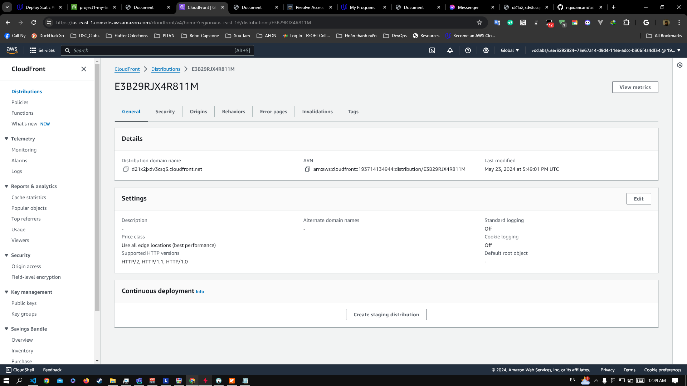

# **Deploy Static Website on AWS | Cloud Developer**

Student: Nguyen Xuan Cam

CloudFront endpoint: https://d21x2jxdv3csq3.cloudfront.net/
Static website: http://project1-my-bucket.s3-website-us-east-1.amazonaws.com/

### Created a S3 bucket

### Content in the S3 bucket

### Bucket policy

### Bucket hosting a static website

### CloudFront has been configured to retrieve and distribute website

